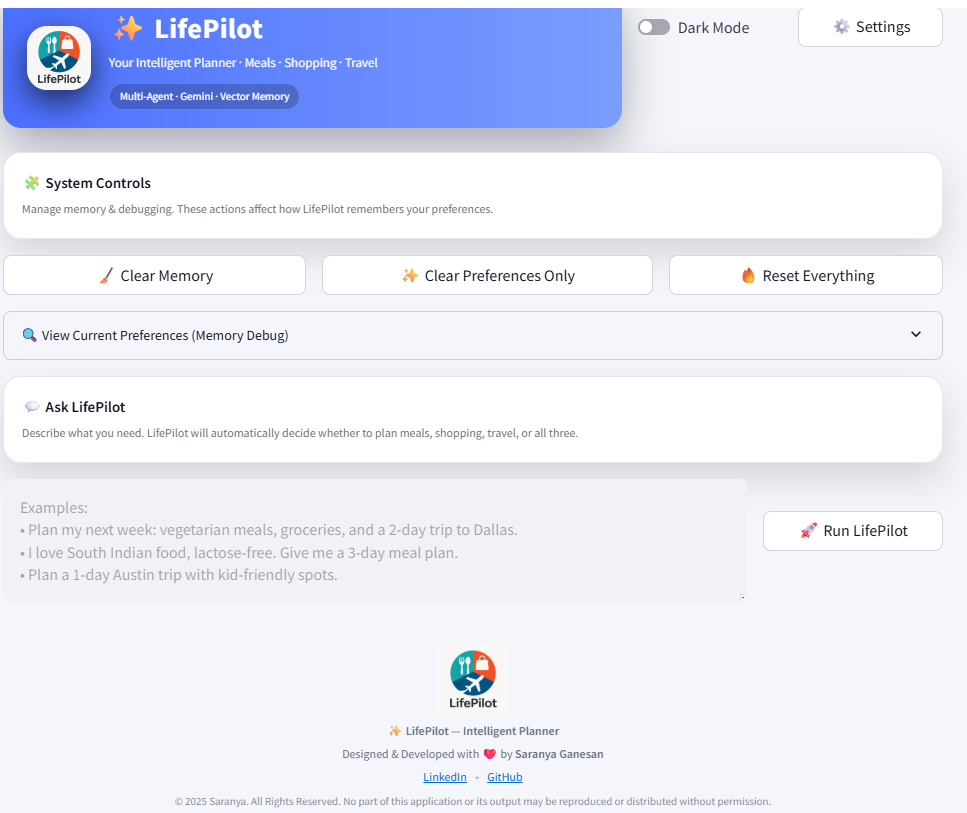

<div align="center">
  

  # ✨ LifePilot — Your Intelligent Planner  
  **A multi-agent AI system that plans Meals, Shopping Lists, and Travel Itineraries intelligently.**

  Designed & Developed with ❤️ by **Saranya Ganesan**
  <br/><br/>

  []()
  []()
  []()
  []()
</div>

---

# 🌟 Overview

**LifePilot** is a smart personal assistant powered by **multi-agent architecture**, using:

- Meal Planner Agent  
- Shopping List Agent  
- Travel Planner Agent  
- Preference Extraction Agent  
- Vector Memory for personalization  
- Streamlit UI  
- PDF generation

It helps users generate:

🍽 **Personalized multi-day meal plans**  
🛒 **Smart shopping lists (max 30 items)**  
✈ **Travel itineraries**  
📄 **Downloadable PDFs**

Everything adapts based on user preferences stored in memory.

---

# 📌 Features

### ✔ Multi-Agent Intelligent Workflow
- Each agent handles a dedicated task.
- The Orchestrator automatically selects agents based on intent.

### ✔ Preference Memory
- Stores user habits, diet choices, dislikes, allergies.
- Uses Google Gemini embeddings + Vector Memory.

### ✔ Clean & Modern UI (Streamlit)
- Premium header with branding  
- Professional footer  
- PDF exports  
- Debug memory viewer  

### ✔ PDF Generation
- ReportLab used for text-based PDFs  
- Built-in copyright footer

### ✔ Fully Local UI (Install & Run)

---

# 📁 Project Structure

LifePilot-Capstone-Project/
│
├── ui/
│ └── app.py # Streamlit application
│
├── agents/
│ ├── meal_agent.py
│ ├── shopping_agent.py
│ └── travel_agent.py
│
├── orchestrator.py # Multi-agent controller
│
├── memory/
│ ├── vector_memory.py
│ └── preference_extractor.py
│
├── utils/
│ └── validators.py
│
├── docs/
│ └── lifepilot_logo.png # App logo
│
├── gen_client.py # Google Gemini API Wrapper
├── requirements.txt
└── LICENSE


---

# 🚀 Installation & Setup

### 1️⃣ Clone the repository

```bash
git clone https://github.com/saranyaganesandeveloper/LifePilot-Capstone-Project.git
cd LifePilot-Capstone-Project

2️⃣ Install dependencies
pip install -r requirements.txt

3️⃣ Set your Google Gemini API Key
export GEN_API_KEY="your-key-here"


Windows PowerShell:

$env:GEN_API_KEY="your-key-here"

4️⃣ Run the app
streamlit run ui/app.py


Your app opens at:

http://localhost:8501

🔧 Configuration

LifePilot uses the Google Generative AI SDK (google-genai==1.52.0) with:

models/gemini-2.5-flash for generation

models/text-embedding-004 for vector memory

You can update these values in:

gen_client.py

🧠 How It Works (Architecture)
flowchart TD
    A[User Query] --> B[Orchestrator]
    B --> C{Intent Detection}

    C -->|Meals| D[Meal Planner Agent]
    C -->|Shopping| E[Shopping Agent]
    C -->|Travel| F[Travel Planner Agent]

    B --> G[Vector Memory Search]
    G --> D
    G --> E
    G --> F

    D --> H[Meal Plan Output]
    E --> I[Shopping List Output]
    F --> J[Travel Plan Output]

    H --> K[PDF Export]
    I --> K
    J --> K

📸 Screenshots

Example:




📄 PDF Copyright Footer

All PDFs generated include:

© 2025 Saranya. All Rights Reserved.
No part of this document may be reproduced or distributed without permission.

🔒 License

This project is proprietary and All Rights Reserved.

See the full license in:

👉 LICENSE

👩‍💻 Author

Saranya Ganesan
Creator of LifePilot — Multi-Agent Intelligent Planner

🔗 LinkedIn:
https://www.linkedin.com/in/saranya-ganesan-texas

🔗 GitHub:
https://github.com/saranyaganesandeveloper

⭐ Support

If you like this project, please ⭐ star the repo on GitHub!